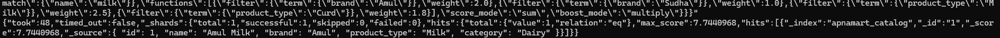
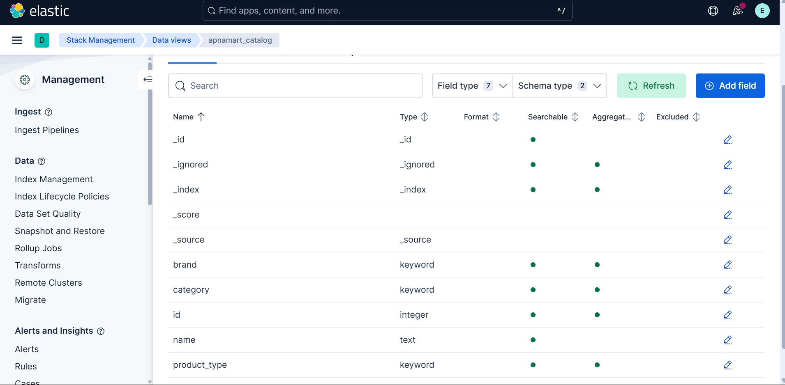
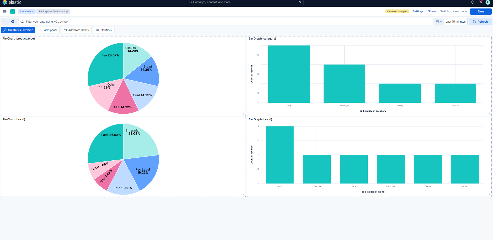
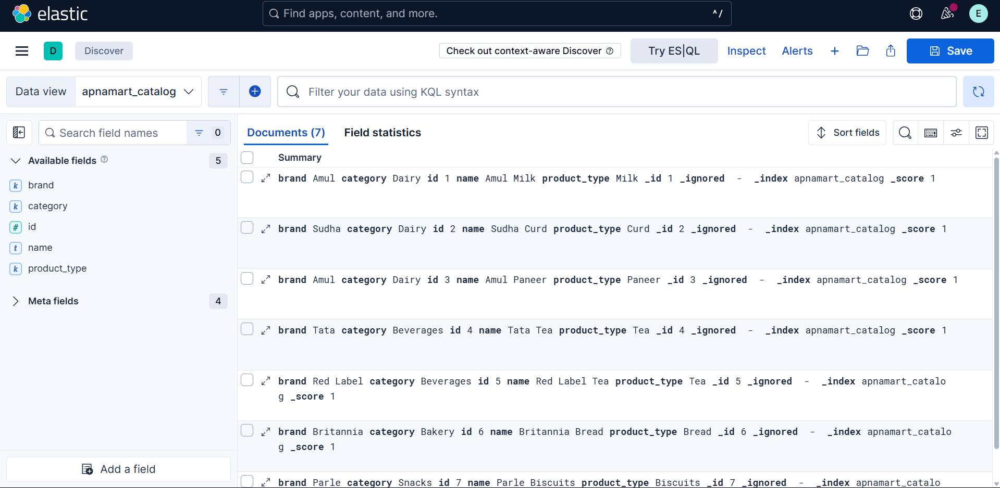

# elasticsearch-kibana-keyword-boosting
# 🔍 Elasticsearch + Kibana: Keyword-Catalog Relevance Boosting

This project demonstrates how to use **Elasticsearch** and **Kibana** to build a relevance boosting system based on **user search behavior** for a product catalog.

## 🚀 Project Overview
- Simulate a search catalog (products, brands, categories)
- Generate synthetic user search logs
- Analyze clicked data to compute boosting scores
- Apply boosting to search results using Elasticsearch's `function_score`
- Visualize catalog, query patterns, and impact in Kibana
---

## 🔄 General Workflow (What Happens Step-by-Step)
- Start Elasticsearch and Kibana with Docker
- Define a catalog schema (mapping) for product fields: name, brand, product_type, etc.
- Index the catalog with example data.
- Simulate user clicks or search interest using search_logs.json.
- Calculate boosting weights using Python, based on user logs.
- Run a function_score query where boosts are applied to brand/product types.
- View results ranked by computed boost score.
- (Optional) Use Kibana to visualize results.

## 📦 Project Structure
```bash
.
├── docker-compose.yml            # Elasticsearch + Kibana setup
├── catalog.json                  # Synthetic catalog data
├── search_logs.json              # Simulated user search behavior
├── catalog_mapping.json          # Elasticsearch mapping for catalog index
├── bulk_catalog.json             # Bulk indexing format for catalog
├── calculate_boosts.py           # Python script to compute boosting weights
├── boost_map.json                # Output of boosting weights
└── README.md
```

## 🐳 Step 1: Run Elasticsearch + Kibana Using Docker

```bash
docker-compose up -d
```
Elasticsearch: http://localhost:9200

Kibana: http://localhost:5601

## 🔐 Step 2: Verify Elasticsearch Running (Optional)
```bash
curl -u elastic:##password## --insecure https://localhost:9200
```

## 📊 Step 3: Index the Catalog in Elasticsearch
```bash
curl -X PUT "localhost:9200/apnamart_catalog" \
-H 'Content-Type: application/json' \
-d @catalog_mapping.json

curl -X POST "localhost:9200/_bulk" \
-H 'Content-Type: application/json' \
--data-binary @bulk_catalog.json
```

## 🧠 Step 4: Generate Boosting Weights
Run the Python script to analyze search logs and compute brand/product_type boost weights:
```bash
python3 calculate_boosts.py > boost_map.json
```
Sample output:
```bash
{
  "milk": {
    "brands": {"Amul": 1.0, "Sudha": 0.5},
    "product_types": {"Milk": 1.0, "Curd": 0.75}
  }
}
```

## 🔎 Step 5: Perform Boosted Search
Example search query for "milk" using boosting:
```bash
curl -X POST "localhost:9200/apnamart_catalog/_search" \
-H 'Content-Type: application/json' -d'
{
  "query": {
    "function_score": {
      "query": {
        "match": { "name": "milk" }
      },
      "functions": [
        { "filter": { "term": { "brand": "Amul" }}, "weight": 2.0 },
        { "filter": { "term": { "brand": "Sudha" }}, "weight": 1.0 },
        { "filter": { "term": { "product_type": "Milk" }}, "weight": 2.5 },
        { "filter": { "term": { "product_type": "Curd" }}, "weight": 1.8 }
      ],
      "score_mode": "sum",
      "boost_mode": "multiply"
    }
  }
}'
```
This makes “Amul Milk” rank higher than other “milk” products.

## ✅ Output Sample (Boosted Result)
```bash
{
  "hits": {
    "total": { "value": 1 },
    "max_score": 7.7440968,
    "hits": [
      {
        "_source": {
          "id": 1,
          "name": "Amul Milk",
          "brand": "Amul",
          "product_type": "Milk",
          "category": "Dairy"
        },
        "_score": 7.7440968
      }
    ]
  }
}

```
This shows that Amul Milk had the highest score after applying the function_score.

## 📦 Step 6 (Optional): View Index Metadata
```bash
curl -u elastic:##password## --insecure -X GET "https://localhost:9200/apnamart_catalog"
```

## 📈 Step 7: Visualize Insights in Kibana
**🔹 Setup Index Patterns**
- Open Kibana at http://localhost:5601
- Go to Stack Management > Index Patterns
- Create patterns for:
  - apnamart_catalog
**🔹 Create Visualizations**
- Top Search Queries
  - Visualization: Bar chart
  - Data: search_logs
  - X-axis: Terms on query
  - Y-axis: Count
- Top Clicked Brands
  - Visualization: Pie chart
  - Data: search_logs
  - Field: clicked_product_id (join manually or use scripted field)
- Product Type Distribution
  - Visualization: Horizontal bar chart
  - Data: apnamart_catalog
  - X-axis: Terms on product_type
**🔹 Create Dashboard**
- Go to Dashboard > Create
- Add all visualizations
- Save as: Search Behavior and Boosting Insights

## 🖼️ Visuals
### **1️⃣ Output Overview**

### **2️⃣ Kibana Overview**

### **3️⃣ Kibana Dashboard**

### **4️⃣ Documents Discover**

### **5️⃣ Pie Chart (product_type)**
.png)
### **6️⃣ Bar Graph (product_type)**
.png)
### **7️⃣ Pie Chart (brand)**
.png)
### **8️⃣ Bar Graph (category)**
.png)
  
## 📜 License
Open-source for learning purposes. Use and modify freely.

---

Let me know if you'd like me to:

- Write the `calculate_boosts.py` output into ES as a new index for Kibana visualizations
- Package this into a Jupyter notebook for better demo
- Help you write a small presentation slide from this

You're now GitHub + Elasticsearch + Kibana ready 🎯
```
